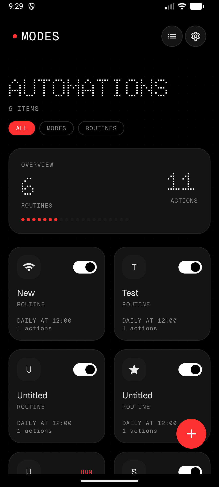
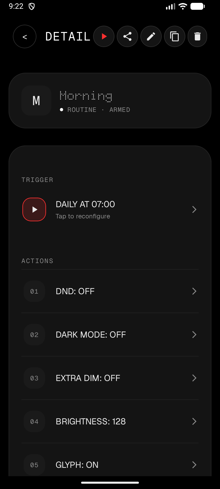
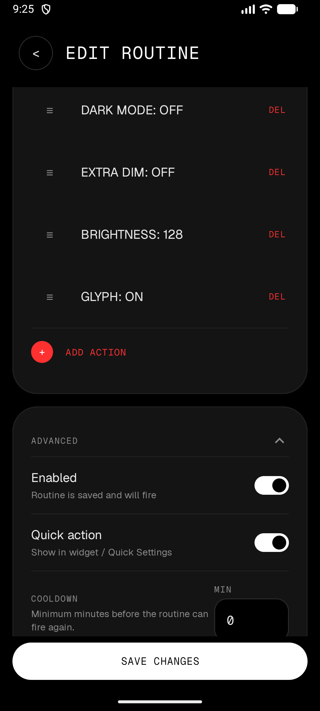
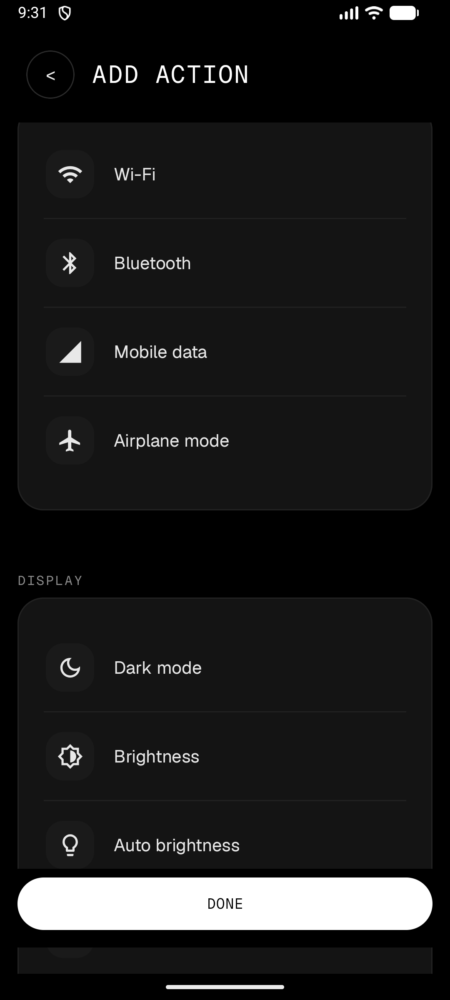

# Nothing Modes

Open-source Android automation for Nothing phones — and every other Android device.

Built like a premium system app: OLED-black surfaces, monoline iconography, dot-matrix hero type, and a single red accent. The engine is pure Kotlin; the UI is Jetpack Compose. Shizuku and Nothing Glyph are supported, not required.

<p align="center">
  
  
  
  
</p>

## What it does

- **Modes** — persistent state configurations (Sleep, Work, Gaming) with automatic state restoration.
- **Routines** — event-based automations: trigger, optional conditions, actions.
- **WHEN / ONLY IF / THEN builder** — explicit, no confusion about what runs when.
- **Nothing Glyph / Glyph Matrix** — light stripe and matrix on supported devices.
- **Shizuku** — optional, graceful degradation everywhere else.
- **Capability detection** — the app asks what the device can do instead of guessing.
- **Priority + cooldown** — deterministic conflict resolution and fire suppression.
- **Import / export / share** — JSON bundles with schema versioning.

## Glyph support

| Device | Glyph Stripe | Glyph Matrix | Glyph Toy |
|---|---|---|---|
| Nothing Phone (1) | Yes | No | No |
| Nothing Phone (2) | Yes | No | No |
| Nothing Phone (2a) / (2a)+ | Yes | No | No |
| Nothing Phone (3a) / (3a) Pro | Yes | No | No |
| Nothing Phone (3) | Yes | Yes (25x25) | Yes |
| Nothing Phone (4a) | Yes | No | No |
| Nothing Phone (4a) Pro | Yes | Yes (13x13) | Yes |
| Nothing Phone (4b) | Yes | No | No |
| Non-Nothing devices | No | No | No |

## Build

```bash
./gradlew assembleDebug
./gradlew :engine-core:test
./gradlew :ui:lintDebug
```

Requires JDK 17+ and Android SDK API 36.

## Architecture

```
app
├── ui                 — Compose screens, theme, design primitives
├── automation-android — services, receivers, scheduler
│   ├── engine-core    — pure Kotlin engine
│   ├── data           — Room stores
│   ├── capabilities   — action executors, capability resolver
│   ├── core-shizuku   — Shizuku gateway
│   ├── device-tools   — shell-based state readers
│   └── nothing-integrations — Glyph SDK wrapper
```

The engine resolves each action through: Public Android API → Nothing API → Shizuku → settings panel fallback.

## Modules

| Module | Role |
|---|---|
| `engine-core` | Pure Kotlin automation engine |
| `device-tools` | Shell-based device state readers |
| `automation-android` | Android lifecycle, services, receivers |
| `ui` | Jetpack Compose screens and design system |
| `core-shizuku` | Shizuku privileged shell transport |
| `capabilities` | Action executors and resolver |
| `nothing-integrations` | Nothing Glyph SDK wrapper |
| `data` | Room persistence |
| `app` | Entry point and nav host |

## Quick start

1. Install on Android 9+.
2. Follow the in-app onboarding for restricted settings and optional Shizuku.
3. Create a mode or routine from the builder, a template, or a shared JSON link.
4. Automations fire on triggers, check conditions, then execute actions in order.

## Templates and sharing

Community templates live in [Nothing-Modes-Templates](https://github.com/Dvorinka/Nothing-Modes-Templates). Contributions follow the repository `CONTRIBUTING.md`.

Share any routine from the detail screen as JSON. Import from a file or a shared bundle. Schema version mismatches are reported before import.

## Shizuku

Optional. Without it, public-API actions still work; Shizuku enables silent toggles for Wi-Fi, Bluetooth, mobile data, dark mode, extra dim, and system settings.

Get Shizuku from [GitHub](https://github.com/RikkaApps/Shizuku/releases) or the Play Store.

## Testing

```bash
./gradlew :engine-core:test
./gradlew connectedCheck
```

## Documentation

- [Architecture](docs/compatibility.md)
- [Nothing SDK](docs/nothing-sdk.md)
- [Shizuku](docs/shizuku.md)
- [TASKS.md](TASKS.md)
- [DECISIONS.md](DECISIONS.md)
- [CHANGELOG.md](CHANGELOG.md)

## License

GPL-3.0

---

Authored By: TDvorak <info@tdvorak.dev>
