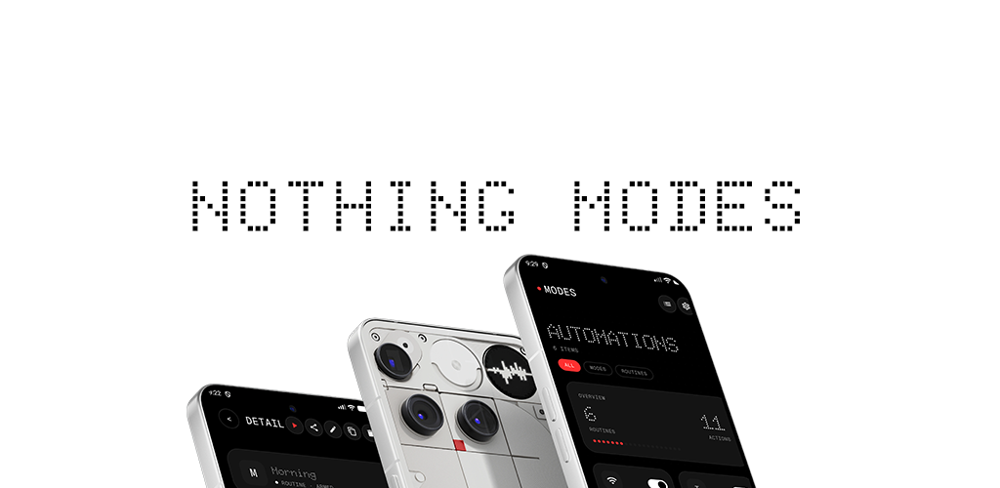

# Nothing Modes

**[nothing-modes.vercel.app](https://nothing-modes.vercel.app)**

Open-source Android automation for Nothing phones — and every other Android device.

Built like a premium system app: OLED-black surfaces, monoline iconography, dot-matrix hero type, and a single red accent. The engine is pure Kotlin; the UI is Jetpack Compose. Shizuku and Nothing Glyph are supported, not required.

<p align="center">
  
</p>

<p align="center">
  
  
  
  
</p>

## What it does

- **Modes** — persistent state configurations (Sleep, Work, Gaming) with automatic state restoration.
- **Routines** — event-based automations: trigger, optional conditions, actions.
- **WHEN / ONLY IF / THEN builder** — explicit, no confusion about what runs when.
- **Nothing Glyph / Glyph Matrix** — light stripe and matrix on supported devices.
- **Shizuku** — optional, graceful degradation everywhere else.
- **Capability detection** — the app asks what the device can do instead of guessing.
- **Priority + cooldown** — deterministic conflict resolution and fire suppression.
- **Import / export / share** — JSON bundles with schema versioning.

## Glyph support

| Device | Glyph Stripe | Glyph Matrix | Glyph Toy |
|---|---|---|---|
| Nothing Phone (1) | Yes | No | No |
| Nothing Phone (2) | Yes | No | No |
| Nothing Phone (2a) / (2a)+ | Yes | No | No |
| Nothing Phone (3a) / (3a) Pro | Yes | No | No |
| Nothing Phone (3) | Yes | Yes (25x25) | Yes |
| Nothing Phone (4a) | Yes | No | No |
| Nothing Phone (4a) Pro | Yes | Yes (13x13) | Yes |
| Nothing Phone (4b) | Yes | No | No |
| Non-Nothing devices | No | No | No |

### How Glyph output works — read this first

Nothing OS hands the Glyph interface to **one selected toy at a time**. Whoever
owns the current Glyph Toy slot (or the Always-on toy slot) is the only app whose
frames reach the lights. There is no API to switch that selection
programmatically — Nothing controls it.

What this means in practice:

- **To see Nothing Modes output**, select **Nothing Modes** in
  *Settings → Glyph Interface → Glyph Toys* (or as the Always-on toy). The
  Glyph Preview screen in the app has shortcut buttons to both pickers and
  shows a live "Matrix owner" status.
- **We cannot trigger other apps' Glyph Toys.** Toy apps can be bound and
  sent lifecycle messages, but their frames never reach the lights while
  another toy owns the slot — we verified this on-device. Nothing Modes
  renders its own equivalents (battery ring, progress, text, marquee, icons)
  instead.
- **If another toy is selected, Glyph actions fail honestly** with
  "matrix owned by another toy" instead of pretending to render. Check the
  "Matrix owner" row in Settings → Glyph Preview — it always shows who
  currently controls the lights.

This exclusivity is Nothing's platform rule, not a limitation we chose. If
Nothing ever exposes a public toy-switching API, we will use it.

## Build

```bash
./gradlew assembleDebug
./gradlew :engine-core:test
./gradlew :ui:lintDebug
```

Requires JDK 17+ and Android SDK API 36.

## Architecture

```
app
├── ui                 — Compose screens, theme, design primitives
├── automation-android — services, receivers, scheduler
│   ├── engine-core    — pure Kotlin engine
│   ├── data           — Room stores
│   ├── capabilities   — action executors, capability resolver
│   ├── core-shizuku   — Shizuku gateway
│   ├── device-tools   — shell-based state readers
│   └── nothing-integrations — Glyph SDK wrapper
```

The engine resolves each action through: Public Android API → Nothing API → Shizuku → settings panel fallback.

## Modules

| Module | Role |
|---|---|
| `engine-core` | Pure Kotlin automation engine |
| `device-tools` | Shell-based device state readers |
| `automation-android` | Android lifecycle, services, receivers |
| `ui` | Jetpack Compose screens and design system |
| `core-shizuku` | Shizuku privileged shell transport |
| `capabilities` | Action executors and resolver |
| `nothing-integrations` | Nothing Glyph SDK wrapper |
| `data` | Room persistence |
| `app` | Entry point and nav host |

## Quick start

1. Install on Android 9+.
2. Follow the in-app onboarding for restricted settings and optional Shizuku.
3. Create a mode or routine from the builder, a template, or a shared JSON link.
4. Automations fire on triggers, check conditions, then execute actions in order.

## Templates and sharing

Community templates live in [`templates/`](templates/) — browse them in-app via the grid icon on the Modes screen. To contribute one, see [`templates/README.md`](templates/README.md).

Share any routine from the detail screen as a JSON bundle. Bundles carry `schemaVersion`, `appVersion`, and `requiredCapabilities`, so imports across users and app versions show compatibility warnings before anything is written.

## Shizuku

Optional. Without it, every action still resolves — silent where the platform allows, a jump to the right settings panel where it doesn't. Shizuku turns the panel fallback into a silent toggle.

Verified on Nothing Phone 3, Nothing OS 4.1, Android 16:

| Action | Without Shizuku | With Shizuku |
| --- | --- | --- |
| Wi-Fi, mobile data, hotspot | connectivity panel | silent toggle |
| Airplane mode | airplane settings | silent toggle (`cmd connectivity`) |
| Battery saver, data saver, auto-sync | settings panel | silent toggle |
| Always-On Display, extra dim | display settings | silent toggle |
| Location mode, refresh rate | settings panel | silent toggle (secure table) |
| Arbitrary `WriteSetting` | permission-required | silent toggle |
| NFC | NFC panel | NFC panel — `svc nfc` is killed on Nothing OS 4.1 even for shell; platform limitation |
| Screenshot | per-capture consent (MediaProjection) | same |
| Everything else — Glyph, volume, ringer, DND, brightness, dark mode, rotation, flashlight, notifications, media, clipboard, app/URL launch, lock screen, SMS | runtime permissions only | unchanged |

Get Shizuku from [GitHub](https://github.com/RikkaApps/Shizuku/releases) or the Play Store, then grant it inside the app's settings sheet.

## Testing

```bash
./gradlew :engine-core:test
./gradlew connectedCheck
```

## Documentation

- [Architecture](docs/compatibility.md)
- [Nothing SDK](docs/nothing-sdk.md)
- [Shizuku](docs/shizuku.md)
- [TASKS.md](TASKS.md)
- [DECISIONS.md](DECISIONS.md)
- [CHANGELOG.md](CHANGELOG.md)

## License

GPL-3.0

---

Authored By: TDvorak <info@tdvorak.dev>
